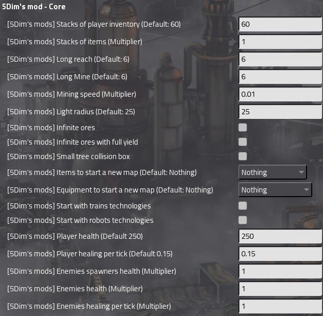
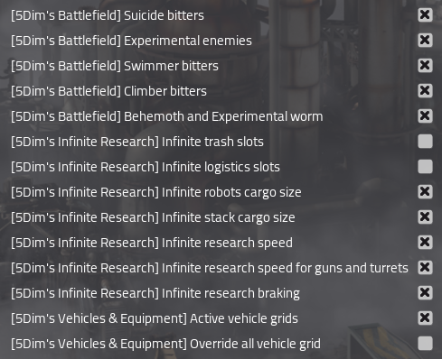

# **5Dim's Mod**


## **Global Links**

- [Patreon](https://www.patreon.com/5Dim)
- [Download from ModPortal](https://mods.factorio.com/mods/McGuten)
- [Issues](https://github.com/McGuten/Factorio5DimMods/issues)
- [Discord community](https://discord.gg/CTEMFd9)
- [Crowdin translation](https://crowdin.com/project/5dims-mod)

## Description

This mod is a **total conversion** with **many modules**, and we recommend using the full set in your game.

## Mod list
### Core module
  - **Core**.
    - Core library and settings for 5Dim's Mod.
    - You can install the modules in an existing save without problems.
    - **REQUIRED for any other module**

### Optional modules
  - **Automation**.
    - Add higher tiers of assembling machines, chemical plants, oil refineries and laboratories.
  - **Battlefield**.
    - Add higher tiers of gun, laser, tesla and support defenses, plus stronger walls, gates and radars.
  - **Decoration**.
    - Adds decorative items such as numbers and letters for base organization.
  - **Enemies**.
    - Adds many new biters, spitters and spawners; recommended for experienced players, so be careful.
  - **Energy**.
    - Add more variety for power generation, storage and electric distribution.
  - **Equipment**.
    - Improves your character with a new bundle of equipment for power armor.
  - **Infinite Research**.
    - Includes infinite technologies and other late-game research upgrades.
  - **Logistics**.
    - Logistics network enhanced with higher tiers of construction robots, logistic robots and roboports.
  - **Mining**.
    - Extracts all kinds of resources at high productivity and also obtains water from almost anywhere.
  - **Module**.
    - Adds higher tiers of modules, pollution and merged modules, plus stronger beacons for dense factory scaling.
  - **Nuclear**.
    - Add higher tiers of reactors, heat hardware, turbines and centrifuges for dense late-game nuclear builds.
  - **Resources**.
    - Add tiered furnaces, mashers and dust processing to push ore refining and smelting throughput.
  - **Space Age**.
    - Add higher tiers for Space Age DLC buildings, equipment and planetary infrastructure.
  - **Storage**.
    - If you hate limited capacity of storage tanks, this mod extends it with new tiers.
  - **Trains**.
    - Add higher tiers of locomotives, cargo wagons and fluid wagons for heavier rail logistics.
  - **Transport**.
    - Add higher tiers of belts, loaders, inserters, pumps and long underground transport **(Require [Bob Inserters](https://mods.factorio.com/mod/bobinserters))**.

### Utility modules
  - **Automated Fuel and Ammo**.
    - Automatically fills vehicles and buildings when you place them.
  - **Development Tools**.
    - Debug and inspection helpers for balancing, validation and enemy generation work.
  - **Locales**.
    - Adds translations for 5Dim's Mod.
  - **Compatibility**.
    - Adds compatibility between 5Dim's Mod and other mods.

## Translations
1. If you want to translate the mod into another language, use the following template or contribute through [Crowdin translation](https://crowdin.com/project/5dims-mod)
2. [5Dim's Locale > locale > en.example](5dim_locale/locale/en.example)
3. Use this template to translate the mod and submit it in a [Pull Request](https://github.com/McGuten/Factorio5DimMods/pulls)

## Errors

### **If you have problems with missing items or you add the mod in mid game you should use this command**
You should also **empty your inventory**, because some items may disappear from it.

This command will refresh all your technologies.
```lua
/c tech = {}
for name,technology in pairs(game.player.force.technologies) do
  if technology.researched == true then
    table.insert( tech, technology.name )
  end
end
game.player.force.reset()
for _, tech_name in pairs(tech) do
  for name,technology in pairs(game.player.force.technologies) do
    if (technology.name == tech_name) then
      technology.researched = true
    end
  end
end
```

## Documentation

The documentation entry point lives in [mods/docs/README.md](docs/README.md).

Useful starting points:

- [mods/docs/design-guide.md](docs/design-guide.md): general design rules and repo reading order.
- [mods/docs/design-modules.md](docs/design-modules.md): per-module summary, routes and canonical exceptions.
- [mods/docs/design-planets.md](docs/design-planets.md): planetary overview of Space Age progression.
- [mods/docs/design-resources.md](docs/design-resources.md): resource catalog, affinities and delta rules.

## Validation

The local validation runner lives in [mods/scripts/validate-factorio-profiles.ps1](scripts/validate-factorio-profiles.ps1). It executes reusable smoke-test profiles for the 5Dim suite without mutating the tracked mod list or config files.

Command examples and profile details are documented in [mods/comandos.md](comandos.md) and [mods/docs/validation-smoke-tests.md](docs/validation-smoke-tests.md).


## Images



